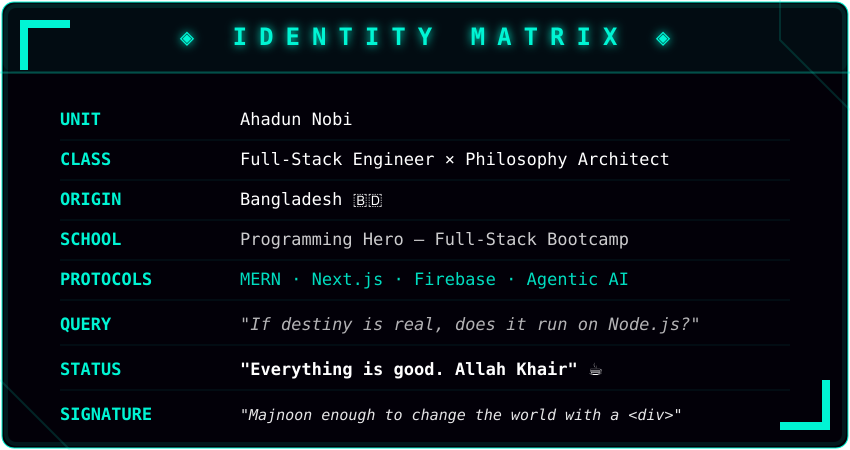

<div align="center">

<!-- 🌌 FUTURISTIC HEADER 🌌 -->


<!-- 💬 PULSING TYPING LOG 💬 -->


<!-- 📡 SYSTEM UPLINKS 📡 -->
<a href="https://ahadunnobi.netlify.app/" target="_blank"></a>&nbsp;
<a href="https://www.linkedin.com/in/ahadunnobi/" target="_blank"></a>&nbsp;
<a href="https://x.com/ahadunnobi" target="_blank"></a>&nbsp;
<a href="https://www.instagram.com/ahadunnobi/" target="_blank"></a>&nbsp;
<a href="https://web.facebook.com/ahadunnobe" target="_blank"></a>


</div>

---

<div align="center">

<!-- 💠 IDENTITY MATRIX 💠 -->


</div>

---


## 🚀 Mission Control
*   **Building:** Scalable full-stack applications with **Firebase** and the **MERN** ecosystem.
*   **Exploring:** Full-Stack Web Development through the [Programming Hero](https://web.programming-hero.com/course-details) bootcamp.
*   **Thinking:** The "System Design" of life — the recursive loops of **Destiny vs. Free Will**.

## ⚡ What I'm Up To

- 🌐 Exploring the power of **Next.js** and Server-Side Rendering
- 🏖️ Working on a comprehensive **Agentic AI** project
- 🧠 Learning advanced **System Design** and Architecture patterns
- 🔐 Deepening my knowledge of **JWT Auth** & **REST APIs**
---
<div align="center">
  <h2>🛠️ THE TECH MATRIX 🛠️ </h2>
</div>

<div align="center">

<table>
<tr>
<td align="center" width="50%">

**◦ FRONTEND LAYER ◦**

<br/>


</td>
<td align="center" width="50%">

**◦ BACKEND & DATABASE ◦**

<br/>


</td>
</tr>
</table>

**◦ DEVOPS & TOOLCHAIN ◦**


</div>

<div align="center">


<div align="center">
  

</div>


---
<div align="center">
  <h2>💭 PHILOSOPHY 💭</h2>

```yaml
"Maybe destiny isn't written in the stars.
Maybe it compiles at runtime —
shaped by every choice, every bug,
every late-night commit."
```

<p>
  <i>If you're reading this — you've entered my codebase.</i><br/>
  <i>That's either fate, or a very good search algorithm.</i>
</p>

<b>Either way: let's build something that matters.</b>
<p>
  ─────────────────────────────────────────────────────────────────<br/>
  Crafted with  ☕ caffeine  ×  🔥 passion  ×  🌙 late nights<br/>
  ─────────────────────────────────────────────────────────────────
</p>
<div align="center">

r=0:020008,100:00f5d4&height=15&section=footer&animation=fadeIn" />
</div>