  

    

  

  

    
    
    
    
    
    
  

## 🚀 Mission Control
*   **Building:** Scalable full-stack applications with **Firebase** and the **MERN** ecosystem.
*   **Exploring:** Full-Stack Web Development through the [Programming Hero](https://web.programming-hero.com/course-details) bootcamp.
*   **Thinking:** The "System Design" of life — the recursive loops of **Destiny vs. Free Will**.

> *"Maybe destiny isn't written in the stars. Maybe it compiles at runtime — shaped by every choice, every bug, every late-night commit."*

---

## ⚡ What I'm Up To

- 🌐 Exploring the power of **Next.js** and Server-Side Rendering
- 🏖️ Working on a comprehensive **Agentic AI** project
- 🧠 Learning advanced **System Design** and Architecture patterns
- 📚 Mastering the **MERN Stack** through [Programming Hero](https://web.programming-hero.com/course-details) bootcamp
- 🔐 Deepening my knowledge of **JWT Auth** & **REST APIs**

---

## 💻 Tech Stack

  <a href="https://skillicons.dev">
    
     
    
     
    
     
    
  </a>

  
  

---

## 📊 Performance Track

  

> **Current Vibe:** "Everything is good. Allah Khair." ☕

---

  <i>"Majnoon" enough to believe I can change the world with a <code>&lt;div&gt;</code>. ☕</i>
    
  

