<div align="center">

<!-- 🌌 FUTURISTIC HEADER 🌌 -->


<!-- 💬 PULSING TYPING LOG 💬 -->


</div>

<div align="center">
  <h3>⚔️ IDENTITY MATRIX ⚔️</h3>
</div>

---

```typescript
const developerProfile = {
  aboutMe: {
    name: "Ahadun Nobi",
    role: "Full-Stack MERN Developer",
    location: "Bangladesh 🇧🇩",
    stack: ["MongoDB", "Express", "React", "Node.js"]
  },
  missionControl: {
    objective: "Building scalable full-stack applications with Firebase & the MERN ecosystem",
    philosophy: "The 'System Design' of life — recursive loops of Destiny vs. Free Will"
  },
  whatImUpTo: [
    "Exploring the power of Next.js and Server-Side Rendering",
    "Working on a comprehensive Agentic AI project",
    "Learning advanced System Design and Architecture patterns",
    "Deepening my knowledge of JWT Auth & REST APIs"
  ]
};
```

---


<div align="center">
  <h3>🔗 CONNECT ME 🔗</h3>

  <!-- 📡 SYSTEM UPLINKS 📡 -->
  <a href="https://ahadunnobi.netlify.app/" target="_blank"></a>&nbsp;&nbsp;
  <a href="https://www.linkedin.com/in/ahadunnobi/" target="_blank"></a>&nbsp;&nbsp;
  <a href="https://x.com/ahadunnobi" target="_blank"></a>&nbsp;&nbsp;
  <a href="https://www.instagram.com/ahadunnobi/" target="_blank"></a>&nbsp;&nbsp;
  <a href="https://web.facebook.com/ahadunnobe" target="_blank"></a>
</div>

<div align="center">
  <h3>🛠️ THE TECH MATRIX 🛠️ </h3>
</div>

<div align="center">

<table>
<tr>
<td align="center" width="50%">

**◦ FRONTEND LAYER ◦**

<br/>


</td>
<td align="center" width="50%">

**◦ BACKEND & DATABASE ◦**

<br/>


</td>
</tr>
</table>

**◦ DEVOPS & TOOLCHAIN ◦**


<br/><br/>


</div>


<div align="center">
  <h3>⏔⏔⏔ ꒰ GitHub Stats ꒱ ⏔⏔⏔</h3> 
</div>


<div align="center">
  
</div>

<div align="center">
  <h3>☯ PHILOSOPHY ☯</h3>

```yaml
"Maybe destiny isn't written in the stars.
Maybe it compiles at runtime —
shaped by every choice, every bug,
every late-night commit."
```

<p>
  ─────────────────────────────────────────────────────────────────<br/>
  Crafted with  ☕ caffeine  ×  🔥 passion  ×  🌙 late nights<br/>
  ─────────────────────────────────────────────────────────────────
</p>


</div>