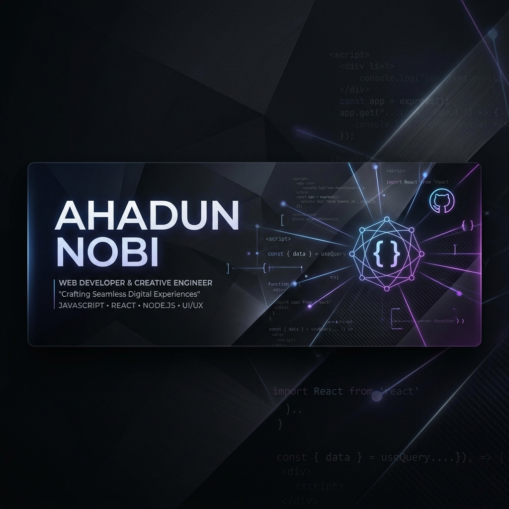

  

    

  

  

    
    
    
    
    
    
  

## 🚀 Mission Control
*   **Building:** Scalable full-stack applications with **Firebase** and the **MERN** ecosystem.
*   **Exploring:** Full-Stack Web Development through the [Programming Hero](https://web.programming-hero.com/course-details) bootcamp.
*   **Thinking:** The "System Design" of life — the recursive loops of **Destiny vs. Free Will**.

---

## 💻 Technologies that I know

  <a href="https://skillicons.dev">
    
     
    
     
    
     
    
  </a>
   
  

---

## 🎓 Currently @ Programming Hero
On a mission to become a **Full-Stack Developer** through the MERN bootcamp — covering everything from responsive UI to server-side architecture, authentication with JWT, and real-world project building.
*   **Current Milestone:** MERN Stack — MongoDB, Express, React, Node.
*   **Key Focus:** Responsive Design, REST APIs, CRUD Operations, and Protected Routes.

---

## 🧠 The "Majnoon" Log
> *"Maybe destiny isn't written in the stars. Maybe it compiles at runtime — shaped by every choice, every bug, every late-night commit."*

---

## 📊 GitHub Activity

  

  

---

## 🌐 Find Me Around the Web

  
  
  
  
  
  

> **Current Vibe:** "Everything is good. Allah Khair." ☕

---

  <i>"Majnoon" enough to believe I can change the world with a <code>&lt;div&gt;</code>.</i>

